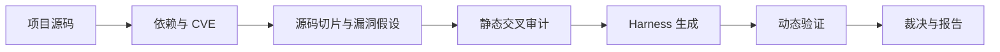
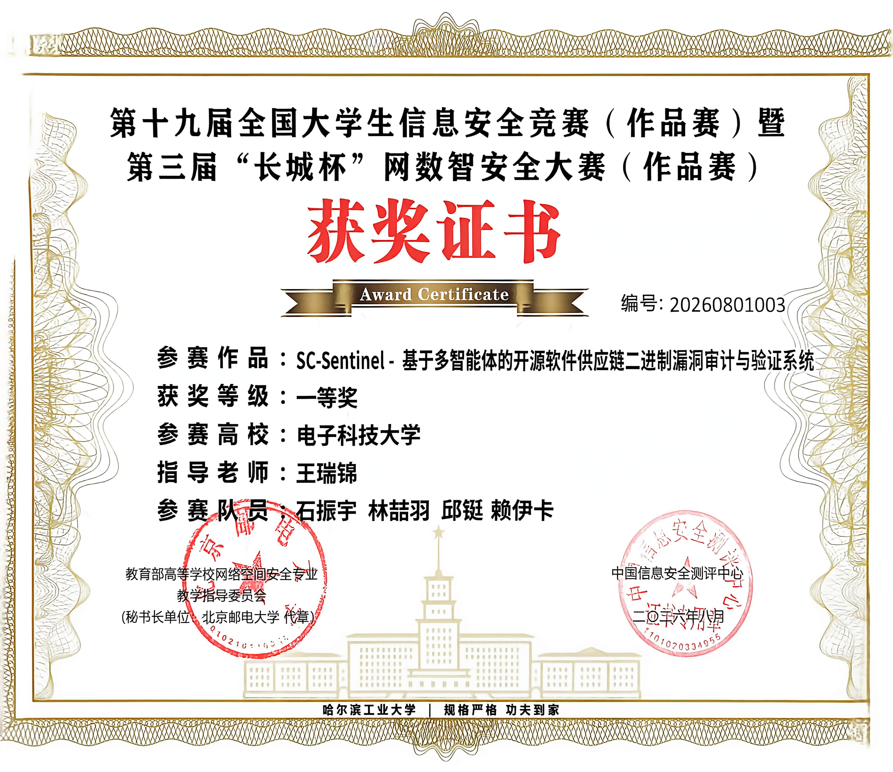

<h1 align="center">SC-SENTINEL</h1>

<p align="center">
  <strong>基于多智能体的开源软件供应链漏洞审计与验证系统</strong>
</p>
<p align="center">
  全国大学生信息安全竞赛（作品赛）参赛项目<br>
  电子科技大学 · 2026 · 项目纪念与学习参考
</p>

<p align="center">
  <a href="https://github.com/Taylor-Lai/SC-SENTINEL-Memorial/actions/workflows/ci.yml"></a>
  <a href="LICENSE"></a>
</p>

<p align="center">
  <a href="#项目介绍">项目介绍</a> ·
  <a href="#从这里开始">学习导航</a> ·
  <a href="materials/SC-SENTINEL-项目文档.pdf">项目文档</a> ·
  <a href="materials/SC-SENTINEL-答辩PPT.pptx">答辩 PPT</a> ·
  <a href="#快速启动">快速启动</a>
</p>

---

## 写在比赛之后

SC-SENTINEL 是我们在 2026 年全国大学生信息安全竞赛（作品赛）中完成的项目，尝试将多智能体分析与动态验证结合，用于开源软件供应链安全审计。

比赛结束后，我们把当时的源码、项目文档、答辩材料和现场照片整理在这里，留作纪念，也方便后来做类似项目的学弟学妹查阅和参考。

这份记录里有我们做过的尝试，也有考虑不够周全的地方。如果其中的思路或实现能给你一些帮助，就很有意义了。

## 项目介绍

SC-SENTINEL 面向 C/C++ 开源项目，把供应链依赖分析、源码审计与动态验证串成一条流程。提交项目后，系统识别依赖与相关 CVE，分析可疑代码，生成用于触发和验证漏洞的测试程序（Harness），最后汇总静态发现与运行时证据，形成审计报告。

| 环节 | 做什么 |
| --- | --- |
| 依赖与风险识别 | 解析项目依赖，结合 OSV / NVD 查询组件及 CVE 风险 |
| 多阶段源码审计 | 提取代码上下文，生成漏洞假设，结合规则与 LLM 交叉审计 |
| 动态验证 | 生成 Harness，结合 ASan、AFL++ 与 eBPF 收集运行时证据 |
| 结果呈现 | 在 Web 界面查看任务进度、代码定位、验证结果，并导出报告 |



报告区分 **已确认、未验证、未复现、误报** 四种状态，保留每项发现的证据与验证边界。完整的七阶段设计见 [架构说明](code/docs/ARCHITECTURE.md)。

## 从这里开始

可以按自己的目的选择入口，无需一次读完整个仓库。

| 你想了解什么 | 推荐入口 |
| --- | --- |
| 快速了解选题、方案和成果 | [答辩 PPT](materials/SC-SENTINEL-答辩PPT.pptx) |
| 系统阅读比赛方案与设计 | [项目文档 PDF](materials/SC-SENTINEL-项目文档.pdf) |
| 在自己的环境中运行项目 | [快速启动](#快速启动) → [部署指南](code/DOCKER.md) |
| 学习模块划分与系统协作 | [代码导航](code/README.md) · [架构说明](code/docs/ARCHITECTURE.md) |
| 研究分析流程与漏洞样本 | [Agent 说明](code/sentinel_agent/README.md) · [测试样本](code/sentinel_agent/samples/) |
| 参考现场演示与答辩准备 | [比赛演示手册](code/docs/COMPETITION_RUNBOOK.md) |

### 仓库结构

主要目录与入口如下：

```text
SC-SENTINEL-Memorial/
├── README.md                     项目介绍与阅读导航
├── .github/                      自动化检查、Issue 与 PR 模板
├── code/                         比赛最终版本的源码与技术文档
│   ├── sentinel_agent/           七阶段分析引擎与漏洞测试样本
│   ├── sentinel_backend/         API、任务调度、存储与沙箱管理
│   ├── sentinel_frontend/        任务提交、实时进度与审计报告界面
│   ├── docs/                     架构说明、安全模型与演示手册
│   ├── scripts/                  环境预检与演示包准备脚本
│   └── docker-compose.yaml       本地部署入口
├── materials/                    项目文档 PDF 与答辩 PPT
└── assets/                       团队合影与获奖证书
```

## 比赛留念

项目参加了第十九届全国大学生信息安全竞赛（作品赛）暨第三届“长城杯”网数智安全大赛（作品赛），获得全国一等奖。这里保留了当时的合影与证书。

参赛作品：SC-Sentinel——基于多智能体的开源软件供应链二进制漏洞审计与验证系统。参赛高校：电子科技大学。

<p align="center">
  <a href="assets/team-at-award-ceremony.png">
    
  </a>
  <br>
  <sub>颁奖现场合影 · 2026 年 · 点击图片查看原图</sub>
</p>

<details>
<summary>查看获奖证书</summary>

<p align="center">
  <a href="assets/first-prize-certificate.png">
    
  </a>
  <br>
  <sub>获奖证书 · 点击图片查看原图</sub>
</p>

</details>

## 快速启动

使用 Docker Compose 启动完整平台：

```bash
git clone https://github.com/Taylor-Lai/SC-SENTINEL-Memorial.git
cd SC-SENTINEL-Memorial/code
cp .env.example .env
# 编辑 .env，至少设置 POSTGRES_PASSWORD
docker compose up -d --build
```

Windows PowerShell 可用 `Copy-Item .env.example .env` 复制配置文件。

| 入口 | 地址 |
| --- | --- |
| Web 界面 | <http://localhost:8080> |
| 后端 API 文档 | <http://localhost:18000/docs> |
| 就绪检查 | <http://localhost:18000/health/ready> |

LLM 配置、动态验证环境及故障排查见 [运行说明](code/README.md) 和 [Docker 部署指南](code/DOCKER.md)。首次体验可以结合 [演示手册](code/docs/COMPETITION_RUNBOOK.md) 使用仓库自带的演示样本。

## 关于学习与复用

如果你准备尝试复现，可以先浏览答辩材料，再用一个小样本熟悉流程，对照报告查看各阶段的输入和输出。也可以只选取感兴趣的模块，结合自己的项目需要作调整。

仓库保留的是比赛结束时的版本。扫描效率、动态验证的环境适配、规则覆盖和部署体验，都是可以继续探索的方向。项目文档与源码可以对照阅读：前者呈现比赛方案，后者记录当时的实现。

欢迎通过 [Issue](https://github.com/Taylor-Lai/SC-SENTINEL-Memorial/issues/new/choose) 反馈文档问题、复现经验或改进建议，也欢迎提交补充说明和教学示例。参与方式见 [贡献指南](CONTRIBUTING.md)。

## 归档与使用说明

- **版本来源**：`code/` 归档自原项目 `main` 分支提交 `26bc50bbd9bb934a6822eafdb73b87dc08e632c9`；仓库整理记录见 [更新日志](CHANGELOG.md)。
- **代码许可**：原创代码采用 [Apache License 2.0](LICENSE)。
- **比赛资料**：照片、证书、项目文档与答辩 PPT 供项目记录和学习参考，不属于上述开源许可范围，详见 [NOTICE](NOTICE)。
- **第三方样本**：部分样本适用独立许可证或仍需核验来源，复用前请查看 [第三方声明](THIRD_PARTY_NOTICES.md)。
- **使用范围**：漏洞样本用于安全研究、教学和授权测试。此仓库为比赛版本归档，未按生产环境标准持续维护；安全问题请按 [安全报告说明](SECURITY.md) 私下反馈。
