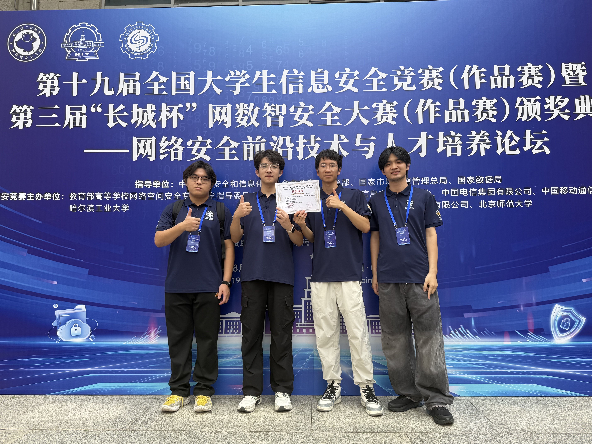

# SC-SENTINEL Memorial

[](LICENSE)
[](https://github.com/Taylor-Lai/SC-SENTINEL-Memorial/actions/workflows/ci.yml)
[](#仓库说明)

这是 SC-SENTINEL 的比赛项目归档。项目参加了第十九届全国大学生信息安全竞赛（作品赛），最终获得全国一等奖。

仓库里保留了比赛时的代码、文档、答辩 PPT 和现场照片，主要用于项目复盘，也方便之后的同学了解系统实现。

## 仓库说明

- 项目方向：C/C++ 开源软件供应链安全与二进制漏洞审计
- 归档版本：`26bc50bbd9bb934a6822eafdb73b87dc08e632c9`
- 当前用途：比赛记录、技术交流和教学参考
- 注意：这是比赛版本，不建议未经评估直接用于生产环境

## 获奖记录

- 赛事：第十九届全国大学生信息安全竞赛（作品赛）暨第三届“长城杯”网数智安全大赛（作品赛）
- 作品：SC-Sentinel——基于多智能体的开源软件供应链二进制漏洞审计与验证系统
- 奖项：全国一等奖
- 学校：电子科技大学
- 时间：2026 年




## 项目简介

SC-SENTINEL 面向 C/C++ 项目，主要包含以下功能：

1. 解析项目依赖，查询相关 CVE；
2. 对源码进行切片和静态分析；
3. 结合规则与大模型生成、复核漏洞假设；
4. 自动生成 Harness 并检查能否正常构建；
5. 使用 ASan、AFL++ 和 eBPF 进行动态验证；
6. 汇总静态与动态结果，生成审计报告。

## 系统组成

```text
code/
├── sentinel_agent/      七阶段安全分析引擎、CVE 客户端与测试样本
├── sentinel_backend/    FastAPI、TaskIQ、PostgreSQL、Redis 与沙箱调度
├── sentinel_frontend/   Vue 3 管理界面
├── docs/                架构、安全模型与比赛运行手册
└── docker-compose.yaml  本地全栈编排入口
```

整体审计链路：

```text
源码摄取
  → 依赖与 CVE 风险识别
  → 语义切片与漏洞假设
  → 静态交叉审计
  → Harness 生成与构建
  → ASan / AFL++ / eBPF 动态验证
  → 风险裁决与报告
```

## 快速开始

详细说明见 [`code/README.md`](code/README.md)。使用 Docker Compose 启动时：

```bash
cd code
cp .env.example .env
# 编辑 .env，至少设置 POSTGRES_PASSWORD
docker compose up -d --build
```

启动后可访问：

- 前端：<http://localhost:8080>
- 后端 OpenAPI：<http://localhost:18000/docs>
- 健康检查：<http://localhost:18000/health/ready>

## 文档导航

- [完整项目说明](code/README.md)
- [系统架构](code/docs/ARCHITECTURE.md)
- [安全模型](code/docs/SECURITY.md)
- [Docker 部署](code/DOCKER.md)
- [比赛运行手册](code/docs/COMPETITION_RUNBOOK.md)
- [贡献指南](CONTRIBUTING.md)
- [安全报告策略](SECURITY.md)
- [第三方许可证清单](THIRD_PARTY_NOTICES.md)
- [版本记录](CHANGELOG.md)
- [学术引用信息](CITATION.cff)

## 写在最后

比赛结束后回头看，这个项目还有不少可以继续改进的地方，比如扫描速度、动态验证的稳定性、规则覆盖和部署方式。我们把当时的版本完整保留下来，没有刻意把它包装成一个已经成熟的产品。

如果学弟学妹想在这个项目上继续做，建议先读 `code/README.md` 和架构文档，把整条审计流程跑通，再根据自己的方向替换其中的模块。遇到问题可以提 Issue，代码改动建议走 Pull Request。

## 使用和授权

- 本仓库保存的是比赛结束时的纪念版本，实际部署前请重新审查依赖、密钥、网络边界和沙箱配置。
- 漏洞样本仅用于安全研究、教学和授权测试，请勿用于未获授权的目标。
- 项目原创代码采用 [Apache License 2.0](LICENSE)。测试样例区存在单独许可证与待核验来源，不受根许可证重新授权，详见 [THIRD_PARTY_NOTICES.md](THIRD_PARTY_NOTICES.md)。
- `assets/memories/` 中的照片、获奖证书以及 `code/SC-SENTINEL答辩ppt.pptx` 不属于 Apache-2.0 授权范围，未经权利人许可不得另行使用或传播。
- 贡献代码前请阅读 [CONTRIBUTING.md](CONTRIBUTING.md)；安全问题请按 [SECURITY.md](SECURITY.md) 中的方式私下报告。
