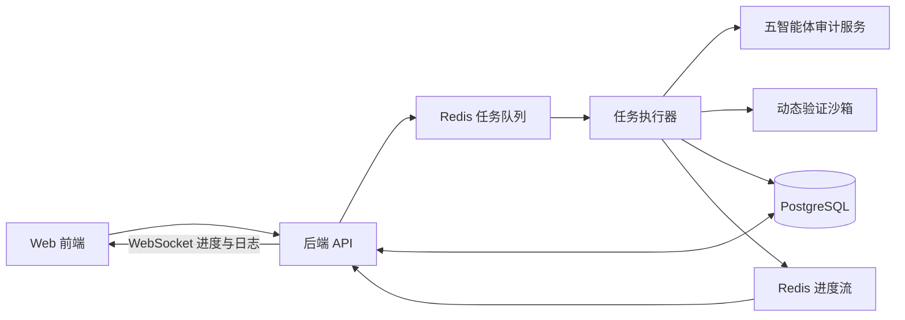

<h1 align="center">SC-SENTINEL</h1>

<p align="center">
  <strong>基于多智能体的开源软件供应链二进制漏洞审计与验证系统</strong>
</p>
<p align="center">
  全国大学生信息安全竞赛（作品赛）参赛项目<br>
  电子科技大学 · 2026 · 项目纪念与学习参考
</p>

<p align="center">
  <a href="https://github.com/Taylor-Lai/SC-SENTINEL-Memorial/actions/workflows/ci.yml"></a>
  <a href="LICENSE"></a>
</p>

---

## 写在比赛之后

SC-SENTINEL 是我们在 2026 年全国大学生信息安全竞赛（作品赛）中完成的项目，将五智能体审计与动态验证结合，构建开源软件供应链二进制漏洞审计与验证平台。

比赛结束后，我们把当时的源码、项目文档、答辩材料和现场照片整理在这里，留作纪念，也方便后来做类似项目的学弟学妹查阅和参考。

本页项目介绍依据比赛项目文档与答辩 PPT 撰写。`code/` 保留首次上传的核心源码，并统一部署配置与模块说明，`materials/` 和 `assets/` 分别保存比赛材料与现场留念。

希望这份记录能为后来做类似项目的同学提供思路，也留下我们一起完成这件作品的记忆。

## 项目介绍

SC-SENTINEL 面向 C/C++ 开源软件供应链，审计对象涵盖源码、ELF / PE 可执行文件与共享库，将依赖识别、漏洞假设、静态复核、验证工件和报告生成组成端到端审计流程。用户提交源码 ZIP 或 Git 仓库地址后，系统自动识别组件与 CVE 风险，定位目标函数，生成结构化漏洞发现和 Harness 验证包，通过隔离沙箱中的 ASan、AFL++ 与 eBPF 执行动态验证，最终交付包含漏洞定位、运行证据和风险裁决的审计报告。

| 环节 | 做什么 |
| --- | --- |
| 依赖与风险识别 | 解析项目依赖，结合 OSV / NVD 查询组件及 CVE 风险 |
| 多阶段源码审计 | 提取代码上下文，生成漏洞假设，结合规则与 LLM 交叉审计 |
| 动态验证 | 生成 Harness，结合 ASan、AFL++ 与 eBPF 收集运行时证据 |
| 结果呈现 | 在 Web 界面查看任务进度、代码定位、验证结果，并导出报告 |

核心技术包括漏洞假设驱动的五 Agent 级联审计、CWE 感知的自动化 Harness 生成，以及 ASan、AFL++、eBPF 三源证据融合与类型纠偏。系统通过切片、假设、Finding、Harness 和动态证据的结构化标识建立完整追踪链，形成从风险发现到运行验证、证据归因和最终裁决的审计闭环。

Harness 包采用目标代码与测试入口分离编译，包含构建文件、配置、种子和 Findings，并通过原型确认、构建就绪与适配需求等质量门控。

报告按 **已确认、需复核、未触发、未验证** 呈现动态状态，并提供漏洞位置、CWE 类别、证据记录和修复建议。

## 系统架构

系统采用前端展示、后端服务、多智能体审计和动态沙箱验证四层架构。后端服务包括 API 与任务执行器；PostgreSQL 保存任务与审计结果，Redis 承担异步任务队列和进度传递。


```mermaid
flowchart LR
    UI[Web 前端] --> API[后端 API]
    API --> Queue[Redis 任务队列]
    Queue --> Worker[任务执行器]
    Worker --> Agent[五智能体审计服务]
    Worker --> Sandbox[动态验证沙箱]
    API <--> DB[(PostgreSQL)]
    Worker --> DB
    Worker --> Progress[Redis 进度流]
    Progress --> API
    API -->|WebSocket 进度与日志| UI
```

系统采用五类智能体协作模型：

| 智能体 | 主要职责 |
| --- | --- |
| 依赖识别 | 识别组件与版本，关联 CVE 风险 |
| 漏洞假设 | 利用函数切片、调用关系和数据流线索，生成候选 CWE 与触发条件 |
| 静态复核 | 结合规则与 LLM 复核漏洞假设，输出结构化发现 |
| 验证工件 | 生成 Harness、种子和构建文件，组织动态验证与证据归因 |
| 报告生成 | 汇总风险与证据，形成可追踪的审计报告 |

五类智能体以结构化中间产物交换信息。依赖识别建立供应链风险背景，漏洞假设将函数切片与数据流线索转化为可检查问题，静态复核确认问题与触发条件，验证工件完成测试入口生成和动态证据归因，报告生成汇总最终风险结论。源码扫描、切片、种子生成和质量门控作为各智能体的内部工具。

系统支持静态审计与动态验证两种执行模式。动态验证融合 ASan 精确错误定位、AFL++ 触发样例与 eBPF 内核运行事件，通过 Harness 标识和目标函数完成证据关联，并利用运行事实修正漏洞类型。LLM 不可用时，规则回退机制保持审计流程连续。完整设计见[项目文档](materials/SC-SENTINEL-项目文档.pdf)，核心技术展示见[答辩 PPT](materials/SC-SENTINEL-答辩PPT.pptx)。

## 从这里开始

可以按自己的目的选择入口，无需一次读完整个仓库。

| 你想了解什么 | 推荐入口 |
| --- | --- |
| 快速了解选题、方案和成果 | [答辩 PPT](materials/SC-SENTINEL-答辩PPT.pptx) |
| 系统阅读比赛方案与设计 | [项目文档 PDF](materials/SC-SENTINEL-项目文档.pdf) |
| 在自己的环境中运行项目 | [快速启动](#快速启动) → [部署指南](code/DOCKER.md) |
| 学习模块划分与系统协作 | [代码导航](code/README.md) · [架构说明](code/docs/ARCHITECTURE.md) |
| 研究分析流程与漏洞样本 | [Agent 说明](code/sentinel_agent/README.md) · [测试样本](code/sentinel_agent/samples/) |
| 参考现场演示与答辩准备 | [比赛演示手册](code/docs/COMPETITION_RUNBOOK.md) |

### 仓库结构

主要目录与入口如下：

```text
SC-SENTINEL-Memorial/
├── README.md                     项目介绍与阅读导航
├── ARCHIVE_STATUS.md             归档内容、版本与检查记录
├── .github/                      归档检查、Issue 与 PR 模板
├── scripts/                      归档完整性检查脚本
├── code/                         原始核心源码、部署配置与技术文档
│   ├── sentinel_agent/           多智能体审计引擎与漏洞测试样本
│   ├── sentinel_backend/         API、任务调度、存储与沙箱管理
│   ├── sentinel_frontend/        任务提交、实时进度与审计报告界面
│   ├── docs/                     架构说明、安全模型与演示手册
│   ├── scripts/                  环境预检与演示包准备脚本
│   └── docker-compose.yaml       本地部署入口
├── materials/                    项目文档 PDF 与答辩 PPT
└── assets/                       团队合影与获奖证书
```

## 比赛留念

项目参加了第十九届全国大学生信息安全竞赛（作品赛）暨第三届“长城杯”网数智安全大赛（作品赛），获得全国一等奖。这里保留了当时的合影与证书。

参赛作品：SC-Sentinel——基于多智能体的开源软件供应链二进制漏洞审计与验证系统。参赛高校：电子科技大学。

<p align="center">
  <a href="assets/team-at-award-ceremony.png">
    
  </a>
  <br>
  <sub>颁奖现场合影 · 2026 年 · 点击图片查看原图</sub>
</p>

<p align="center">
  <a href="assets/first-prize-certificate.png">
    
  </a>
  <br>
  <sub>获奖证书 · 点击图片查看原图</sub>
</p>

## 快速启动

准备好支持 Linux 容器的 Docker 与 Docker Compose 后，在本地启动平台：

```bash
git clone https://github.com/Taylor-Lai/SC-SENTINEL-Memorial.git
cd SC-SENTINEL-Memorial/code
cp .env.example .env
# 编辑 .env，至少设置 POSTGRES_PASSWORD
docker compose up -d --build
```

Windows PowerShell 可用 `Copy-Item .env.example .env` 复制配置文件。

动态验证使用专用沙箱镜像，在 `code/` 目录执行 `docker compose --profile sandbox build sandbox` 完成构建。部署流程与环境配置见[部署指南](code/DOCKER.md)。

| 入口 | 地址 |
| --- | --- |
| Web 界面 | <http://localhost:8080> |
| 后端 API 文档 | <http://localhost:18000/docs> |
| 就绪检查 | <http://localhost:18000/health/ready> |

前端使用演示账号 `sentinel-demo` / `sentinel2026` 登录，具体说明见 [前端文档](code/sentinel_frontend/README.md#演示登录)。该账号用于比赛演示。

LLM 配置、动态验证环境及故障排查见 [运行说明](code/README.md) 和 [Docker 部署指南](code/DOCKER.md)。首次体验可以结合 [演示手册](code/docs/COMPETITION_RUNBOOK.md) 使用仓库自带的演示样本。

## 关于学习与复用

建议先浏览答辩 PPT，了解选题、核心技术和成果展示，再阅读项目文档，系统学习五智能体职责、Harness 生成与动态证据融合。运行项目时可从仓库自带样本开始，查看各阶段输入、输出与最终报告。

仓库保留完整的比赛源码和设计材料，便于学习模块划分、异步任务编排、结构化审计追踪与沙箱验证。也可以围绕感兴趣的模块，在自己的项目中继续研究与扩展。

欢迎通过 [Issue](https://github.com/Taylor-Lai/SC-SENTINEL-Memorial/issues/new/choose) 反馈文档问题、复现经验或改进建议，也欢迎提交补充说明和教学示例。参与方式见 [贡献指南](CONTRIBUTING.md)。

## 维护状态

本仓库作为比赛项目纪念归档，供教学、研究和学习参考，后续不安排常规功能开发。CI 保留源码归档完整性与文档导航检查，Dependabot 定期版本升级 PR 已停止。

归档版本、资料清单与整理记录见[归档说明](ARCHIVE_STATUS.md)。

## 归档与使用说明

- **版本来源**：核心源码保留本仓库首次上传提交 `ce5a1308b7daceb2de8f3b537fddbd325b31c7a0` 的内容；部署配置、依赖兼容约束与模块文档完成同步整理；原项目来源记录为 `main` 分支提交 `26bc50bbd9bb934a6822eafdb73b87dc08e632c9`。仓库整理记录见 [更新日志](CHANGELOG.md)。
- **代码许可**：原创代码采用 [Apache License 2.0](LICENSE)。
- **比赛资料**：照片、证书、项目文档与答辩 PPT 供项目记录和学习参考，不属于上述开源许可范围，详见 [NOTICE](NOTICE)。
- **第三方样本**：部分样本适用独立许可证或仍需核验来源，复用前请查看 [第三方声明](THIRD_PARTY_NOTICES.md)。
- **使用范围**：漏洞样本用于安全研究、教学和授权测试。安全问题请按 [安全报告说明](SECURITY.md) 私下反馈。
