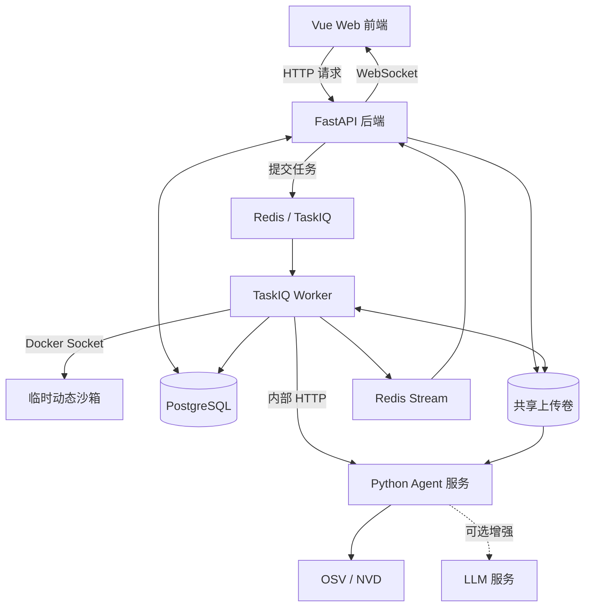
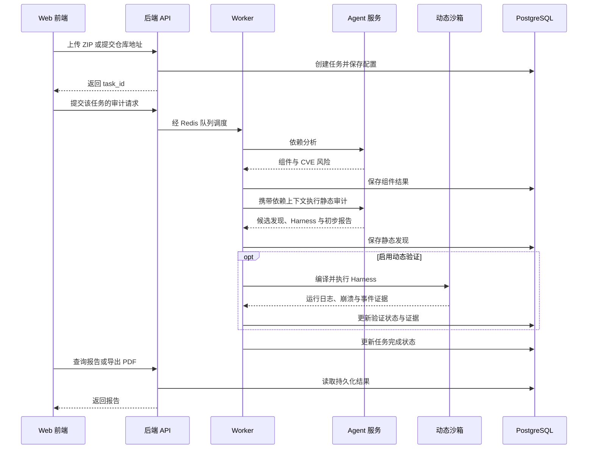

# 系统架构

本文说明比赛归档版本的组件关系、分析流程与实现入口。适合结合 [代码导航](../README.md) 阅读；环境配置见 [部署指南](../DOCKER.md)。

## 设计思路

SC-SENTINEL 将依赖风险识别、源码审计和动态验证串成可追踪的任务流程。依赖信息用于提供风险背景，静态分析用于提出候选问题，动态验证用于补充可复现证据，报告保留各类结论的适用范围。

“七个 Agent”指七个分析阶段，并不对应七个独立部署的服务。当前实现将这些阶段封装在同一个 Python 分析服务中，后端 Worker 负责跨服务调度和结果持久化。

## 组件关系

| 组件 | 当前职责 | 主要源码入口 |
| --- | --- | --- |
| Web 前端 | 提交源码、选择策略、查看进度和报告 | [页面](../sentinel_frontend/src/views/)、[API 调用](../sentinel_frontend/src/api/) |
| API 服务 | 校验请求、接收上传、创建和调度任务、查询与导出报告 | [应用入口](../sentinel_backend/app/main.py)、[接口](../sentinel_backend/app/api/v1/) |
| Worker | 编排依赖分析、静态审计与可选动态验证，持久化结果 | [流水线](../sentinel_backend/app/worker/pipeline.py)、[阶段任务](../sentinel_backend/app/worker/) |
| Agent 服务 | 执行分析阶段，返回组件、候选漏洞及 Harness 包 | [服务入口](../sentinel_agent/service.py)、[分析阶段](../sentinel_agent/agents/) |
| 动态沙箱 | 编译 Harness、运行 ASan/AFL++、收集可用的 eBPF 事件 | [沙箱管理](../sentinel_backend/app/services/sandbox_manager.py)、[镜像与脚本](../sentinel_backend/docker/) |
| PostgreSQL | 保存任务、组件风险、漏洞记录和 eBPF 事件 | [数据模型](../sentinel_backend/app/models/)、[迁移](../sentinel_backend/alembic/) |
| Redis | 保存队列与任务结果，转发实时进度 | [消息队列](../sentinel_backend/app/core/broker.py)、[进度流](../sentinel_backend/app/core/progress_stream.py) |

外部 CVE 查询和 LLM 调用依赖网络及相应服务配置。规则回退减少了对 LLM 的依赖，但不代表所有外部数据查询都可以离线完成。

## 七阶段分析流程

| 阶段 | 主要输入 | 处理与输出 | 实现 |
| --- | --- | --- | --- |
| A：依赖识别 | 源文件、构建文件与依赖声明 | 识别组件并查询相关 CVE，生成依赖风险上下文 | [agent_a_dependency.py](../sentinel_agent/agents/agent_a_dependency.py) |
| B：源码切片 | C/C++ 源文件 | 提取函数级代码片段与上下文，供后续分析使用 | [agent_b_slicer.py](../sentinel_agent/agents/agent_b_slicer.py) |
| C：漏洞假设 | 依赖上下文与源码切片 | 提出候选漏洞类型及分析线索 | [agent_c_hypothesis.py](../sentinel_agent/agents/agent_c_hypothesis.py) |
| D：交叉审计 | 依赖、切片与假设 | 结合规则与 LLM 复核，输出静态发现 | [agent_d_llm_audit.py](../sentinel_agent/agents/agent_d_llm_audit.py) |
| E：Harness 生成 | 静态发现与项目源码 | 生成测试入口、构建文件与种子，标记构建就绪情况和人工适配需求 | [agent_d_harness.py](../sentinel_agent/agents/agent_d_harness.py) |
| F：证据归因 | 静态发现、Harness 与动态验证产物 | 将运行时证据关联到候选发现 | [agent_f_dynamic_evidence.py](../sentinel_agent/agents/agent_f_dynamic_evidence.py) |
| G：裁决与报告 | 各阶段结果 | 汇总验证状态、风险信息与报告内容 | [agent_g_final_report.py](../sentinel_agent/agents/agent_g_final_report.py) |

阶段 E 保留了历史文件名 `agent_d_harness.py`，入口通过别名将其作为 Agent E 调用。阅读源码时，应以当前入口的调用关系为准。其本地编译检查参数默认关闭，因此 `build_ready` 是生成阶段的就绪判断，不能当作编译成功或漏洞已复现的证明；Web 动态流程中的实际编译由沙箱完成。

## Web 平台的一次审计

1. 创建任务与启动审计是两个接口：`POST /api/v1/tasks` 接收源码并创建任务，`POST /api/v1/audit/submit` 将已有任务送入队列。
2. Worker 解压 ZIP 或克隆允许访问的仓库，调用 Agent A，将组件风险写入数据库。
3. Worker 将已保存的依赖上下文传给静态审计接口。接口在有组件上下文时复用它，未收到组件上下文时会重新运行依赖分析。
4. 静态审计接口执行 B 至 E，并在没有动态证据的情况下执行 F、G，形成初步结果。Worker 保存候选发现，将返回的 Harness 文件写入后端管理的目录。
5. 静态任务直接结束；动态任务继续执行沙箱，由后端根据运行结果更新数据库中的验证状态与证据。当前 Web 流程不会在沙箱结束后再次调用 Agent G，最终 Web/PDF 报告以数据库结果为准。
6. 执行期间，Worker 向 Redis Stream 发布进度，API 通过 WebSocket 转发给前端。进度流是临时状态，持久化任务与报告保存在 PostgreSQL。定时心跳只说明任务仍在等待结果，不代表已观测到 AFL++ 覆盖率或 eBPF 事件。

取消请求先持久化为终态；动态验证 Worker 每隔约 5 秒检查状态并清理沙箱。API 不需要 Docker Socket，取消后不再发布完成报告的进度消息。

SBOM 和静态分析阶段保存结果时会替换该阶段的旧记录，避免重试造成重复追加。

## 命令行与 Web 的区别

| 运行方式 | 入口 | 动态验证方式 | 结果位置 |
| --- | --- | --- | --- |
| 命令行分析 | [main.py](../sentinel_agent/main.py) | 通过 `--validation` 读取已有的 ASan/AFL++/eBPF 产物；命令本身不调度后端沙箱 | 输出目录中的阶段 JSON、最终 JSON 和 Markdown 报告 |
| Web 平台 | 前端 → API → Worker | 开启动态验证后，由 Worker 创建临时沙箱并回收结果 | 数据库、Web 报告与 PDF 导出 |

CLI 的 `--output` 和 `--harness` 参数可以分别指定报告与 Harness 输出目录。未提供动态证据时，静态发现保持相应的未验证状态，不自动加载样本中的模拟证据。

## 如何理解报告

| 验证状态 | 含义 |
| --- | --- |
| `confirmed` | 已确认：获得支持该发现的运行时复现证据 |
| `unverified` | 未验证：尚无充分运行时证据，包括未运行验证或执行出错等情况 |
| `not_reproduced` | 未复现：完成了相应动态验证，但未在当前预算内触发问题 |
| `false_positive` | 误报：经确定性规则或复核明确排除 |

任务完成不表示每条发现都已验证成功，仍需逐条查看状态与错误日志。报告中的证据等级（如 `candidate`、`partial_evidence`）是另一类字段，用来描述证据充分程度，不是额外的验证状态。

组件关联的 CVE 提供供应链风险线索；源码发现描述当前代码中的候选问题。二者需要结合调用上下文和运行时证据理解，不能直接互相等同。ASan 提供内存错误诊断，AFL++ 探索输入并产生崩溃样本，eBPF 提供可用的运行时事件；具体结论应结合报告所记录的证据来源判断。

## 存储与部署边界

默认 Compose 使用 `uploads_data` 在 API、Worker 和 Agent 之间共享源码目录。PostgreSQL 与 Redis 分别使用独立数据卷；Agent 还会在自身目录生成 `outputs/` 和 `harness_packages/`。这些运行产物不属于归档源码，清理容器或数据卷前应确认需要保留的内容。

Agent 端口默认仅在 Compose 内部网络开放；API 和 Worker 通过内部 HTTP 调用它。只有 Worker 挂载 Docker Socket 来管理沙箱，API 不直接创建执行容器。当前本地编排仍共用宿主机 Docker，不能视为控制层与执行层的物理隔离。

动态沙箱默认断网、只读根文件系统、禁用特权模式，并限制 CPU、内存、PID 与运行时长。eBPF 特权兼容路径需要专用隔离环境。前端登录是演示访问控制，长期部署还需后端身份认证、权限控制和执行环境隔离，具体见 [安全模型](SECURITY.md)。

## 建议的源码阅读顺序

先读 [命令行入口](../sentinel_agent/main.py) 理解阶段输入输出，再读 [Agent 服务](../sentinel_agent/service.py) 理解 HTTP 封装。随后查看 [后端流水线](../sentinel_backend/app/worker/pipeline.py)、[动态验证任务](../sentinel_backend/app/worker/fuzzing_task.py) 和 [报告接口](../sentinel_backend/app/api/v1/tasks.py)，最后结合 [前端页面](../sentinel_frontend/src/views/) 了解用户操作与结果展示。

研究评测时，将 [可见测试项目](../sentinel_agent/samples/level2_testset/) 作为分析输入，在运行结束后再对照 [评测基准](../sentinel_agent/samples/level2_oracle/README.md)。评测基准包含答案与验证材料，不应作为待审计源码提交。

[返回代码导航](../README.md) · [返回项目主页](../../README.md)
